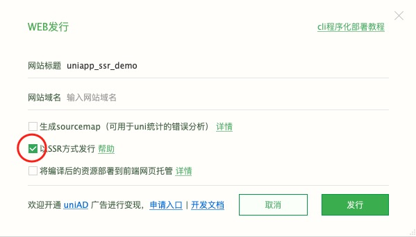

# uniapp-router-h5  for  <a href="https://uniapp.dcloud.net.cn">uni-app</a>

#### 仅支持uni-app Vue3项目 不支持Vue2 (因为uni-app vue2不支持ssr)

## uni-app ssr(服务器渲染) + 动态路由(伪静态) + seo优化

## 用途：

实现uni-app的h5项目的搜索引擎seo优化提高网站排名终极解决方案。

## 功能：

1. uni-app h5项目(Vue3)动态路由 也就是伪静态路由(网上并没有相关的功能 据说有一家支持但收费)<br><br>
2. ssr(服务器渲染)将uni-app项目在服务器上转为静态页面并实现服务端的动态路由。<br><br>
3. 突破uni-app官方ssr必须托管代码并使用uniCloud(云函数)的限制 可以任何平台运行<br><br>
4. seo优化 支持每个页面设置meta 关键词 描述等 (动态路由设置页面关键词有单独的说明)

## 开始使用：

1. 下载安装

```sh
git clone https://github.com/fzl51/uniapp-router-h5.git
cd uniapp-router-h5
npm install
```

2. 运行

```sh
npm start
```

或者

```sh
node main.js
```

此时打开 http://localhost:8080 就能看到最终效果 演示效果：https://v.yy2169.com 鼠标右键查看源码看效果

## 使用文档：

### uniapp_seo目录

uni-app项目源码 里面是演示如何使用。<br>

1. 在main.js导入路由 会自动hook路由增加动态路由(伪静态)

```js
//uniapp_seo/main.js
import './router'
```

2. 配置路由方法1: uniapp_seo/router.js (推荐) 2选1

```js
//uniapp_seo/router.js
const seoRoutes = {
    "/pages/index/h5": "/h5/:name"
}
```

3. 配置路由方法2: 直接在pages.json 设置(微信小程序端会有提示 可以加条件编译)
```json
{
    "path": "pages/index/seo",
    "style": {
      // #ifdef H5 
      "seoPath":"/seo/:name",
      // #endif 
      "navigationBarTitleText": "uni-app seo 动态路由 伪静态"
    }
}
```

4. 路由格式：支持动态高级路由(伪静态) /h5/:id 这种路径也支持 /h5 这样的静态路径
<br><br>
5. seo优化
 ```html
//uniapp_seo/pages/index/h5
<page-meta>
    <head>
        <title></title>
        <meta name="description" content="uniapp h5 seo搜索引擎优化 支持伪静态" />
        <meta name="keywords" content="uniapp seo,uniapp ssr,uniapp 伪静态" />
    </head>
</page-meta>
```
6. 动态页面设置不同的meta关键词 页面数据等信息 

   
## 设置

### 1.在uniapp设置路由mode:   **history**


### 2.发布的时候设置ssr发行 (**Vue3才支持**)




web目录：

一部分是
<br><br>支持动态高级路由(伪静态) /h5/:id 这种路径<br><br>
这是一个演示uni-app如何实现ssr服务器渲染<br><br>
如何动态路由<br><br>
不使用uniapp官方指定的云函数来实现

`uniapp_ssr_demo` 是解决 [uniapp](https://uniapp.dcloud.net.cn) 项目ssr(服务器端渲染),实现seo的解决方案。
<br>官方提供了[ssr解决方案](https://doc.dcloud.net.cn/uni-app-x/web/ssr.html) 截止发稿前必须要使用uniCloud 云函数。
<br>这是实现uniCloud不需要云函数解决方案。

## 安装

```sh
npm install
```

**Note:** 关键是需要安装最新的 @dcloudio/uni-app 及 @dcloudio/uni-h5。 <br>
以后出现版本不兼容的情况 [这里查询](https://github.com/dcloudio/uni-app/tags) 最新版本号
在package.json修改版本号 执行安装

## 设置

### 1.在uniapp设置路由mode   **history**


### 2.发布的时候设置ssr发行 (vue3才支持)


## 复制生成好的client跟server目录到该项目根目录运行

```sh
npm start
```

## 注意事项

1. 不能有环境代码。详情可以看官方的[说明](https://doc.dcloud.net.cn/uni-app-x/web/ssr.html) 比如 window document
2. 还有很多api不支持 比如 uni.getSystemInfoSync
3. App.vue不会调用 需要在main.js挂载钩子
4. 如果有npm包 需要在服务器上的项目安装一遍
5. 为每个页面实现不同的meta信息需要自己实现 这个项目只提供uniapp的ssr解决办法。
6. 注意链接 都是onclik事件
7. 如果有不兼容的代码 会node报错 不会服务器渲染 但不影响网页运行
8. ssr很多代码不兼容 多到让你怀疑人生 做好心里准备。
